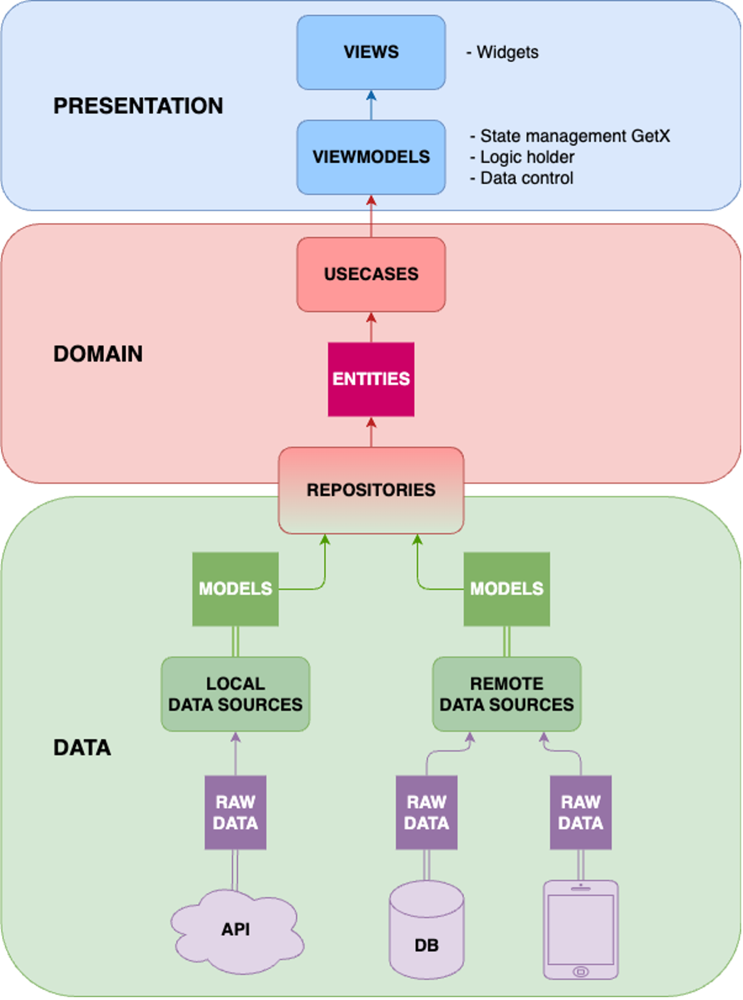

# Traning Plan
1. Setup môi trường và run sample của Flutter: https://docs.flutter.dev/get-started/install
=> Làm quen với IDE VSCode và ngôn ngữ Dart
2. Đào tạo kiến thức về Clean Architecture, MVVM, Getx trong Flutter qua project mẫu sử dụng cho dự án Flutter-Template
=> Hiểu về kiến trúc dự án Clean Architecture, cây thư mục chứa source, MVVM (model: data, view: screen, viewmodel: controller), GetX, binding...
3. Đọc source code project Flutter-Template và hiểu về Getx
=> Hiểu cách hoạt động của Model, View, ViewModel, Controller trong dự án Flutter
4. Task: Thay đổi phần giao diện Đăng nhập của dự án Template. Ghép API Đăng nhập của dự án Template.
=> Dev giao diện bằng Getx với những widget cơ bản Flutter. Ghép API, làm model, nhận dữ liệu trong Flutter.
5. Task: Giao diện Home đơn giản của Template (appbar, listview text, bottom bar), luân chuyển được giữa giao diện Home và Login. Refresh giao diện Home khi dữ liệu thay đổi.
=> Hiểu được cách chuyển qua lại giữa các màn hình. Dev giao diện bằng widget nâng cao như Listview, gridview. Cách truyền data cục bộ và data toàn cục. Sử dụng Getx Obx để tự động load lại giao diện khi data thay đổi.
# Clean Architecture + MVVM, GetX

|- presentation: Lớp giao diện người dùng, chịu trách nhiệm hiển thị dữ liệu và xử lý sự kiện từ người dùng. MVVM sẽ được tích hợp trong lớp này.

|- domain: Lớp chứa logic kinh doanh và quy tắc nghiệp vụ của ứng dụng. Nó định nghĩa các đối tượng, các use case và các interface cho việc giao tiếp với lớp data.

|- data: Lớp đảm nhiệm việc truy xuất dữ liệu từ các nguồn khác nhau như cơ sở dữ liệu, API, cache, v.v. Nó cung cấp dữ liệu cho lớp domain.

# Project Structure
lib/

|- app - Nơi khai báo các thông tin chung của app như config, constants, language...
*    config: Khai báo theme và binding của app
*    constants: Khai báo colors, strings, numbers, styles, assets...
*    lang: Khai báo các text hiển thị trên app theo ngôn ngữ
*    utils: Khai báo các đoạn mã code sử dụng chung cho toàn bộ dự án như size util, time ulti...

|- presentation: Lớp giao diện người dùng, chịu trách nhiệm hiển thị dữ liệu và xử lý sự kiện từ người dùng. MVVM sẽ được tích hợp trong lớp này.
*    modules: Chứa các module theo tính năng của ứng dụng. Trong mỗi module thường sẽ bao gồm 3 thành phần chính là view, viewmodel (state management), binding (dependency injection module)
*    routes: Cấu hình định tuyến các module
*    widgets: Chứa các widget giao diện người dùng như buttons, forms, list items…

|- data: Lớp đảm nhiệm việc truy xuất dữ liệu từ các nguồn khác nhau như cơ sở dữ liệu, API, cache, v.v. Nó cung cấp dữ liệu cho lớp domain.
*    data_sources: Chứa các Data Sources để truy cập dữ liệu từ các nguồn như cơ sở dữ liệu local, tệp tin,...
*    repositories: Chứa các Repository Implementations triển khai các interface Repository từ Domain Layer. Repository sử dụng Data Sources để lấy và lưu trữ dữ liệu.
*    models: Chứa các đối tượng dữ liệu.

|- main.dart - Main entry.

## Yêu cầu bắt buộc
1. Sử dụng VSCode để lập trình
2. Extensions
* GitLens
3. Code format setting
* Formatting code: Mặc định của VSCode.
* Thêm đoạn mã sau vào setttings.json để sắp xếp thứ tự import và format code không xuống dòng
    "editor.codeActionsOnSave": {
        "source.organizeImports": true,
    },
    "dart.lineLength": 200,

## Quy tắc và quy ước

Coding convention: https://dart.dev/effective-dart/style
1. Cách đặt tên:
* Đặt tên English, có ý nghĩa
* Theo chuẩn của Dart: Class UpperCamelCase, file lowercase_with_underscores, variable lowerCamelCase
2. Sử dụng private với các hàm, biến chỉ sử dụng trong Class
* Ví dụ: biến count chỉ sử dụng trong Class thì khai báo: int _count;
3. Không sử dụng prefix:
* Good: defaultTimeout 
* Bad: kDefaultTimeout
4. Sử dụng đóng mở ngoặc ở các đoạn mã if/else
* Good: if (isWeekDay) {
          print('Bike to work!');
        } else {
          print('Go dancing or read a book!');
        }
* Bad: if (overflowChars != other.overflowChars)
         return overflowChars < other.overflowChars;
5. Check lint warning: Khi save file, check tất cả các lint warning và ko được để file còn lint warning.
6. Với những mục có nhiều param thì phải thêm dấu phẩy ở cuối của param cuối để vscode auto format xuống dòng. Ví dụ:
* Không phẩy ở cuối:
        Text('welcome'.tr, textAlign: TextAlign.center, style: Theme.of(context).textTheme.headlineLarge)
* Có phẩy ở cuối:
        Text(
          'welcome'.tr,
          textAlign: TextAlign.center,
          style: Theme.of(context).textTheme.headlineLarge,
        ),
7. Tách hàm với các đoạn code dài (Đặc biệt chú ý file screen)
8. Chỉ sử nháy đơn với String:
* Đúng: 'Đây là String'
* Sai: "Đây là String"
9. Tất cả các String đều phải đặt trong file ngôn ngữ: app/lang/vi.dart
10. Tất cả constants phải đặt trong các file thuộc thư mục app/constants
* app_colors: Khai báo constants mã màu cardColor, schemeSeedColor...
* app_nums: Khai báo constants number borderRadius, spacing...
* app_strings: Khai báo constants string baseUrl, apiKey...
11. Cấu trúc đặt tên: <-Feature name-> + <Detail (Có thể có hoặc không)> + <-Type Class->
* Đúng:
LoginScreen = Feature 'Login' + Type Class 'Screen'
RegisterScreen = Feature 'Register' + Type Class 'Screen'
RegisterOtpScreen = Feature 'Register' + Detail 'Otp' + Type Class 'Screen'
* Sai: ScreenLogin
12. Quy ước tiền tố
ảnh, sơ đồ  img
vector      svg
thumbnail	thumb
banner	    bn
button	    btn
logo	    logo
navi	    nav
tiêu đề     ttl
text	    txt
icon	    icon
Background (ngoài background của icon)	bg
mũi tên	    arrow
line	    line
pagetop 	pagetop
spacer      spacer
đang loading    loading
* Ví dụ: btnContact, svgContact...
